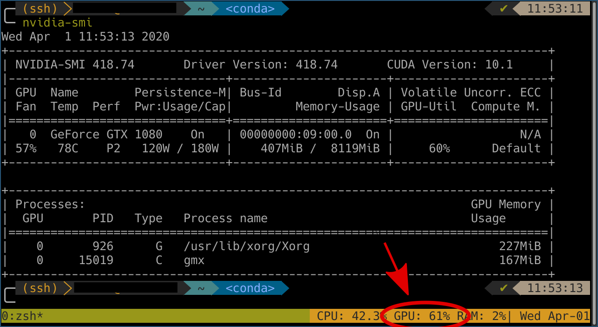

# tmux-plugin-simple-gpu
tmux plugin showing GPU usage



Requirements
------------
Nvidia cuda toolkit must be installed (the plugin internally calls `nvidia-smi`)


Installation
------------
### Installation with [Tmux Plugin Manager](https://github.com/tmux-plugins/tpm) (recommended)

Add plugin to the list of TPM plugins in `.tmux.conf`:

```
set -g @plugin 'danijoo/tmux-plugin-simple-gpu'
```

Hit `prefix + I` to fetch the plugin and source it.

If format strings are added to `status-right`, they should now be visible.

Usage
-----

In order to see GPU usage via this tmux plugin, add the following command to your `.tmux.conf` file:

```
#{gpu}
```

Kudos
----------
I used https://github.com/pwittchen/tmux-plugin-ram as a base for this project.
